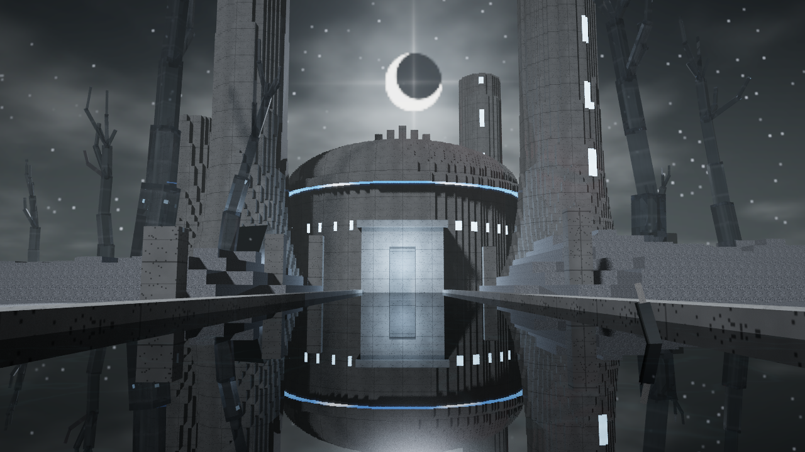
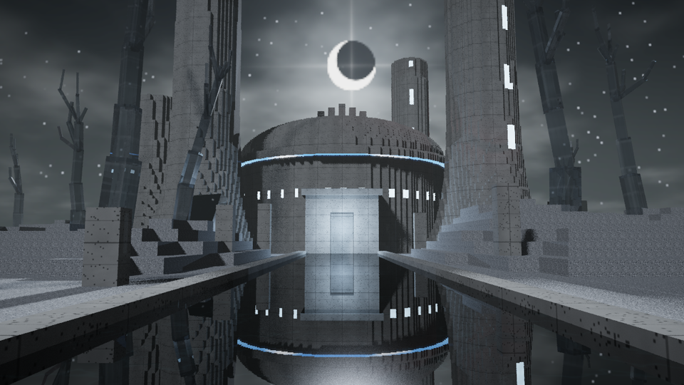
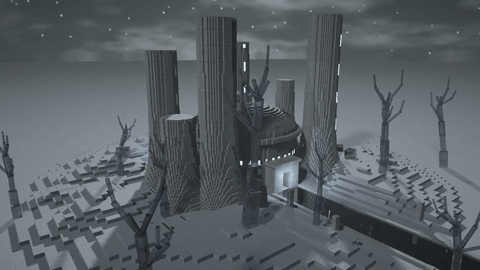
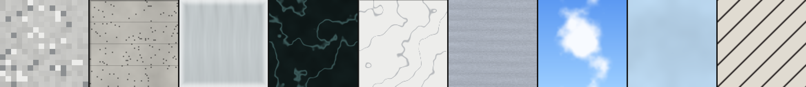
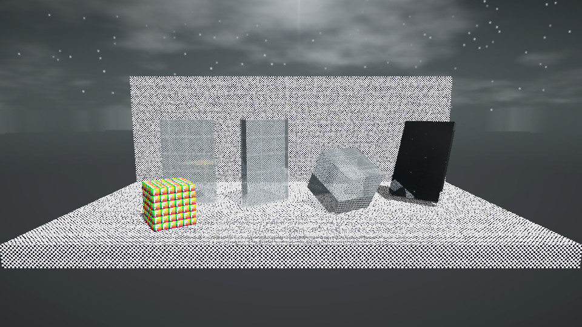
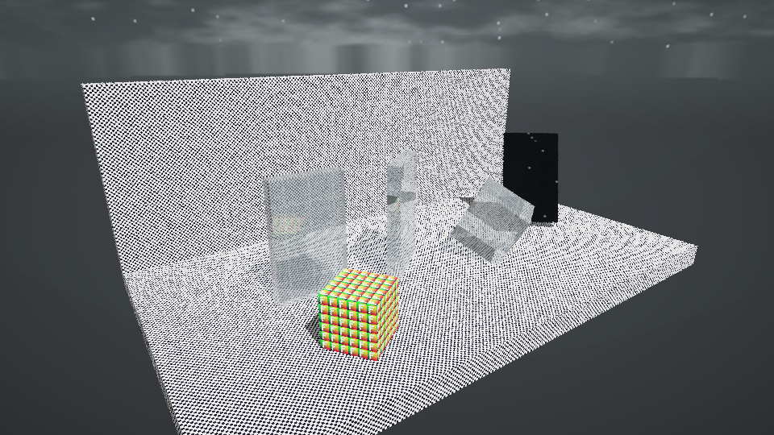
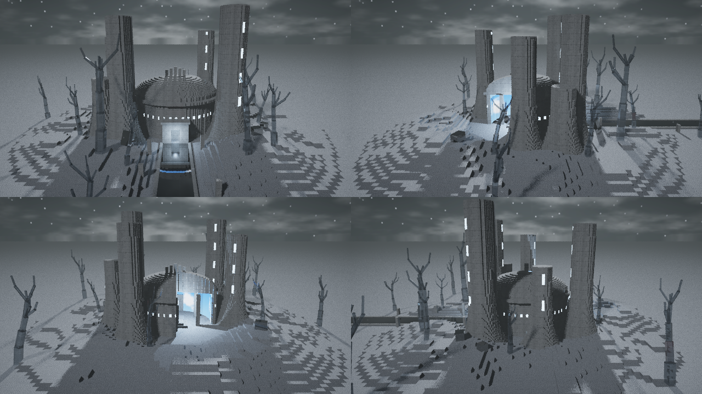
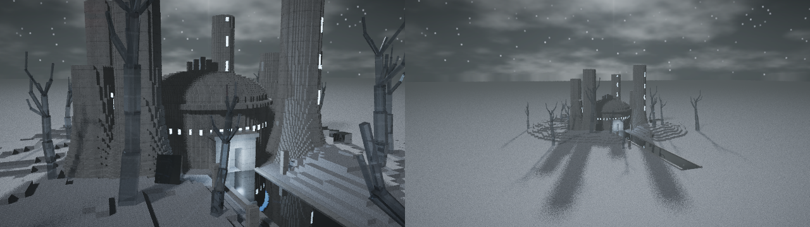

# Las Noches bajo la Luna Eterna

**Proyecto 2 — Gráficas por Computadora: Diorama con Raytracing**

Un diorama de bloques inspirado en *Hueco Mundo* (Bleach): un desierto blanco bajo una noche que nunca termina, un bosque de árboles de cuarzo y la fortaleza de **Las Noches**, cuya cúpula abierta esconde un **cielo diurno falso**. Clavada en una duna, la espada **Zangetsu** refleja una **Garganta** roja que se abre en el cielo *detrás* del espectador: solo se puede ver en el reflejo del acero.

Todo está hecho con un raytracer escrito desde cero en **Rust, usando únicamente la biblioteca estándar** (0 dependencias). Las texturas y el skybox también son originales y los genera el propio proyecto.



## Video

[](docs/video/las_noches.mp4)

> Clic en la imagen para abrir el video (`docs/video/las_noches.mp4`, 60 s, 1280×720, 30 fps).



---

## Cómo ejecutar

**Requisitos:** [Rust](https://www.rust-lang.org/) (probado con 1.97, edición 2024) en **Windows 10/11**. No hay nada más que instalar: el proyecto no tiene dependencias (`cargo tree` muestra solo `las_noches`).

```bash
cargo run --release
```

Eso abre la ventana interactiva. Otros modos:

| Comando | Qué hace |
|---|---|
| `cargo run --release` | Ventana interactiva (rotación y zoom en vivo) |
| `cargo run --release -- --render salida.png --w 1920 --h 1080 --spp 32` | Render final a PNG (opcional: `--yaw`, `--pitch`, `--dist`, `--target x,y,z`, `--depth`) |
| `cargo run --release -- --video cuadros/ --spp 8` | Cuadros BMP del recorrido del video (reanudable, con `--from`/`--to`) |
| `cargo run --release -- --diag carpeta/` | Escenas de diagnóstico (refracción, reflexión, UV, skybox) |
| `cargo run --release -- --bench` | Mide el tiempo por cuadro de cada modo de calidad |
| `cargo run --release --bin gen_textures` | Regenera todas las texturas y el skybox en `assets/` |
| `cargo test --release` | Pruebas numéricas de óptica, UV y límites de la cámara |

> La ventana usa la API de Windows (`user32`/`gdi32`) declarada a mano por FFI. En otros sistemas operativos el render a PNG (`--render`) y el video funcionan igual.

## Controles

| Tecla | Acción |
|---|---|
| **← / →** o **A / D** | Rotar el diorama sobre su eje vertical |
| **↑ / ↓** | Inclinar la cámara |
| **W / S**, **+ / −** o **rueda del mouse** | Acercar / alejar (cambia la **distancia real** de la cámara, no el FOV) |
| **Arrastrar con clic izquierdo** | Rotar e inclinar |
| **1 / 2 / 3** | Calidad rápida / balanceada / alta |
| **R** | Volver a la vista inicial |
| **P** | Guardar captura PNG en `capturas/` |
| **Esc** | Salir |

El zoom está limitado (distancia 21–70) para que la cámara nunca entre en la geometría; `cargo test` verifica que el radio del diorama queda dentro de ese límite. Mientras se mueve, la imagen se calcula a baja resolución; al soltar, se refina progresivamente a 1280×720 acumulando muestras (se reinicia con cualquier cambio). El título de la ventana muestra rotación, inclinación, distancia, muestras y ms/cuadro.

La **rotación es del diorama**, no una órbita de la cámara: los rayos se transforman al espacio del diorama, mientras que el cielo y la luna se quedan fijos en el mundo. Por eso la luz de la luna recorre el diorama al girarlo, como una maqueta sobre una base giratoria.

---

## Rúbrica y evidencia

> Nota: los puntos listados en la rúbrica suman **130**, mientras que la nota máxima indicada es **100**. Este proyecto cubre todos los criterios; la forma de escalar la nota la define el catedrático.

| Criterio | Puntos | Implementación | Evidencia |
|---|---:|---|---|
| Complejidad de la escena | 30 | `src/scene.rs`: **975 cubos** texturizados (terreno por columnas, cúpula de bloques con corte, torres, 6 árboles de cuarzo, 7 racimos de cristal, ruinas, espada) + 1 esfera | Imágenes de abajo y video |
| Atractivo visual | 20 | Dirección de arte propia: silueta torre + luna, paleta monocromática fría con acentos cian (cielo falso) y rojo (Garganta) | `docs/img/hero.png`, `docs/img/angulos.png` |
| Rotación del diorama y zoom | 20 | `src/window.rs` (entrada y refinamiento), `src/renderer.rs::View` (rotación), `src/camera.rs` (zoom por distancia) | Ventana interactiva; `docs/img/zoom.png`; video 4–19 s (360°) y 45–58 s (zoom) |
| 5 materiales (textura + albedo, especular, transparencia, reflectividad) | 25 | `src/material.rs`, texturas en `assets/textures/` | [Tabla de materiales](#materiales) |
| Refracción con sentido | 10 | Árboles y cristales de **cuarzo** (IOR 1.54) con Snell, Fresnel y reflexión interna total | `docs/img/mat_cuarzo.png`, `docs/img/diag_frente.png`, video 40–45 s |
| Reflexión | 5 | **Acero** de Zangetsu (0.78) y **obsidiana** de la plaza (0.55) | `docs/img/mat_acero.png`, `docs/img/mat_obsidiana.png` |
| Skybox | 20 | Cubemap de 6 caras BMP (`assets/skybox/`), muestreado por **todos** los rayos que no chocan (primarios, reflejados y refractados) | Luna, estrellas y Garganta en `docs/img/hero.png`; la Garganta solo aparece reflejada en la espada |

## Materiales

Los valores vienen directamente de `src/material.rs`. Significado de cada parámetro:

- **albedo:** fracción de luz difusa que devuelve la superficie; se multiplica por el color de la textura.
- **especular / brillo:** intensidad y exponente del brillo de Phong.
- **transparencia:** fracción de luz transmitida (rayo refractado).
- **reflectividad:** fracción de luz reflejada como espejo.
- **IOR:** índice de refracción.

La parte difusa pesa `1 − reflectividad − transparencia`. En materiales transparentes, Fresnel (Schlick) pasa parte de la transparencia a reflexión en ángulos rasantes, así que la suma nunca supera 1.

| # | Material | Textura | Albedo | Especular (int., exp.) | Transparencia | Reflectividad | IOR | Dónde está | Evidencia |
|---|---|---|---:|---|---:|---:|---:|---|---|
| 1 | Arena de Hueco Mundo | [`sand.bmp`](assets/textures/sand.bmp) | 0.85 | 0.04, 8 | 0 | 0 | — | Dunas del terreno | [mat_arena](docs/img/mat_arena.png) |
| 2 | Piedra de Las Noches | [`stone.bmp`](assets/textures/stone.bmp) | 0.82 | 0.25, 40 | 0 | 0.06 | — | Cúpula, torres, ruinas | [mat_piedra](docs/img/mat_piedra.png) |
| 3 | Cuarzo | [`quartz.bmp`](assets/textures/quartz.bmp) | 0.10 | 0.9, 220 | 0.82 | 0.06 | 1.54 | Árboles y cristales | [mat_cuarzo](docs/img/mat_cuarzo.png) |
| 4 | Obsidiana | [`obsidian.bmp`](assets/textures/obsidian.bmp) | 0.20 | 0.9, 300 | 0 | 0.55 | — | Plaza, ventanas, moldura del zócalo | [mat_obsidiana](docs/img/mat_obsidiana.png) |
| 5 | Acero de Zangetsu | [`steel.bmp`](assets/textures/steel.bmp) | 0.18 | 1.0, 500 | 0 | 0.78 | — | La espada | [mat_acero](docs/img/mat_acero.png) |
| + | Cielo falso (emisivo 1.1) | [`fake_sky.bmp`](assets/textures/fake_sky.bmp) | 0.35 | — | 0 | 0 | — | Interior de la cúpula | hero |
| + | Hueso Hollow | [`bone.bmp`](assets/textures/bone.bmp) | 0.85 | 0.4, 60 | 0 | 0.04 | — | Máscara | angulos |
| + | Basalto | [`basalt.bmp`](assets/textures/basalt.bmp) | 0.70 | 0.15, 20 | 0 | 0 | — | Zócalo | hero |
| + | Vendaje | [`hilt.bmp`](assets/textures/hilt.bmp) | 0.80 | 0.05, 10 | 0 | 0 | — | Mango de la espada | mat_acero |



## Arquitectura

```
src/
  main.rs         modos: ventana, --render, --video, --diag, --bench
  window.rs       ventana Win32 por FFI, entrada, calidad adaptativa, refinamiento progresivo
  video.rs        recorrido de cámara por claves (interpolación suave), cuadros deterministas
  diag.rs         escenas de diagnóstico
  lib.rs          módulos del raytracer:
  math.rs         Vec3, Mat3 (rotaciones), RNG determinista
  camera.rs       cámara orbital con zoom por distancia y límites
  geometry.rs     cubo (slabs, normal y UV por cara), esfera, objetos rotados
  bvh.rs          BVH sobre cajas envolventes (división por mediana)
  material.rs     parámetros de los materiales
  texture.rs      texturas (sRGB→lineal, bilineal) y skybox cubemap
  scene.rs        construcción del diorama, luces
  renderer.rs     trazado recursivo, sombreado, Fresnel, tone mapping
  image_io.rs     BMP (lectura/escritura) y PNG (escritura) sin librerías
  bin/gen_textures.rs   generador procedural de texturas y skybox
tests/optica.rs   pruebas de Snell, reflexión interna total, UV, skybox y límites
```

### Técnicas de raytracing

1. **Cámara:** cámara estenopeica con FOV de 45°. El zoom mueve la cámara sobre la línea de vista (`camera.rs`).
2. **Rotación del diorama:** cada rayo se lleva al espacio del diorama con la inversa de `rot_y(yaw)`. La BVH se construye una sola vez y sigue siendo válida, y el cielo se muestrea con la dirección en el mundo (`renderer.rs::View`).
3. **Intersección rayo–cubo (slabs):**
   - Devuelve la cara de entrada, o la de salida si el rayo nace dentro, algo necesario al salir de un cristal.
   - La normal apunta hacia afuera.
   - Las UV van por cara y en unidades de mundo (una textura por bloque), orientadas para no quedar en espejo (probado en `tests/optica.rs`).
   - Los cubos rotados (espada, cristales) transforman el rayo a su espacio local; la normal vuelve con la misma rotación.
4. **BVH:** nodos con hojas de ≤4 objetos. El recorrido visita primero el hijo más cercano.
5. **Iluminación:**
   - Luna direccional con **sombras suaves** (dirección muestreada dentro de un cono pequeño y promediada entre muestras).
   - Luz de relleno tenue.
   - Una luz puntual dentro de la cúpula que se escapa por el corte.
   - Ambiente hemisférico.
   - El material emisivo "cielo falso" se ve encendido pero no ilumina por sí mismo: esa luz la aporta la luz puntual.
6. **Sombras a través de cristal:** el rayo de sombra atraviesa materiales transparentes multiplicando por `transparencia × tinte` (sombras tintadas, sin cáusticas). Los opacos bloquean.
7. **Reflexión y refracción recursivas** (máx. 6 rebotes en el render final):
   - Snell con `n1/n2` según si el rayo entra o sale (se detecta con `d·n > 0` y se invierte la normal).
   - **Reflexión interna total** cuando `sin²θt > 1`: toda la parte transmitida pasa a reflexión.
   - **Fresnel de Schlick** para repartir reflexión y transmisión.
   - Si el rayo ya no aporta (peso < 1%) o se acaba la profundidad, se aproxima con el skybox.
8. **Autointersección:** el origen de los rayos secundarios se desplaza `±N·0.002` según el lado (afuera para reflexión y sombras, adentro para refracción).
9. **Skybox:** cubemap de 6 caras con convención de OpenGL, muestreado con filtro bilineal fijo al borde de cada cara. La ida y vuelta dirección↔cara está probada.
10. **Color:**
    - Las texturas se convierten de sRGB a lineal una vez al cargarlas.
    - Todo el cálculo es lineal.
    - Al final se aplica exposición, tone mapping ACES y conversión a sRGB **una sola vez** (sin doble gamma).
11. **Antialiasing y determinismo:** jitter subpíxel con un generador PCG sembrado por (x, y, muestra). El mismo comando produce exactamente la misma imagen, así que el video es estable.
12. **Paralelismo:** `std::thread::scope` con un contador atómico de filas.

## Rendimiento

Medido con `cargo run --release -- --bench` en la laptop de desarrollo: Intel Core i7-1185G7 (4 núcleos / 8 hilos), 32 GB RAM, **solo CPU**, vista héroe, 1 muestra por píxel.

| Modo | Resolución | Rebotes | Sombras suaves | ms/cuadro |
|---|---|---:|:---:|---:|
| Vista previa (en movimiento) | 320×180 | 2 | no | PENDIENTE |
| Refinado | 640×360 | 6 | sí | PENDIENTE |
| Final | 1280×720 | 6 | sí | PENDIENTE |

En la ventana (calidad 2), mientras se mueve se renderiza a 426×240 y luego se acumulan muestras a 1280×720. Render final de la imagen héroe (1280×720, 32 spp): PENDIENTE. Video (1800 cuadros, 1280×720, 8 spp): PENDIENTE.

## Verificación

- `cargo test --release`: 8 pruebas:
  - incidencia normal sin desviación
  - ley de Snell a 40°
  - reflexión interna total (60° sí, 30° no)
  - Fresnel dentro de [0,1]
  - entrada y salida del cubo
  - UV sin espejo en las 4 caras laterales
  - ida y vuelta del skybox
  - el diorama cabe dentro del límite de zoom
- `--diag` (imágenes abajo):
  - Una lámina de cuarzo de frente no desplaza el tablero; girada 40°, sí lo desplaza.
  - Un cubo de cuarzo girado muestra reflexión interna.
  - Un espejo de acero refleja el tablero y el cielo estrellado (skybox en rayos secundarios).
  - El cubo con la letra "F" confirma la orientación de las UV.




## Vistas




## Limitaciones conocidas

- La ventana interactiva es solo para Windows (API Win32 por FFI). En otros sistemas se pueden usar `--render` y `--video`.
- Es un raytracer tipo Whitted:
  - No hay iluminación global ni cáusticas.
  - La luz que atraviesa el cuarzo se aproxima con sombras tintadas.
  - El brillo del "cielo falso" se ilumina con una luz puntual, no con el material emisivo.
- Después de moverse, el primer cuadro a resolución completa tarda unos cientos de milisegundos en esta CPU, porque todo se calcula en el procesador.
- El PNG que escribe el proyecto usa deflate sin compresión, así que los archivos son más grandes que un PNG normal.

## Recursos y licencias

- **Todo el arte es original**: texturas, skybox, luna, estrellas y Garganta se generan con `src/bin/gen_textures.rs`. No se usaron imágenes de terceros.
- La escena es un homenaje (fan art) a *Bleach* de Tite Kubo. Los nombres Hueco Mundo, Las Noches, Garganta y Zangetsu pertenecen a su obra; aquí no se usa ningún recurso de la serie.
- **Herramienta de desarrollo (no es dependencia del proyecto):** el video MP4 y la vista previa GIF se armaron a partir de los cuadros BMP con **FFmpeg**. El programa no la usa ni la necesita para compilar o ejecutarse.
